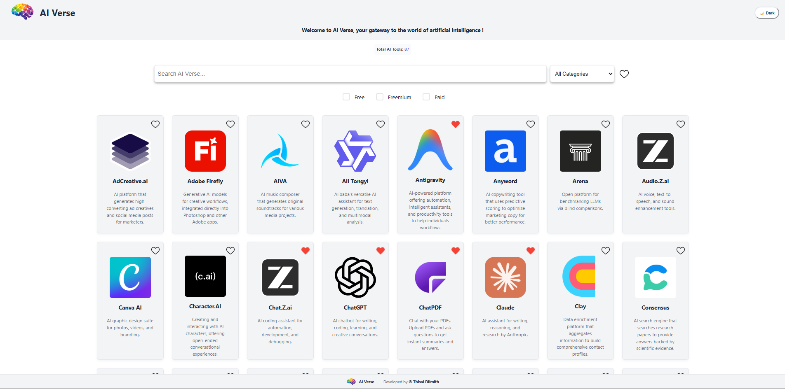
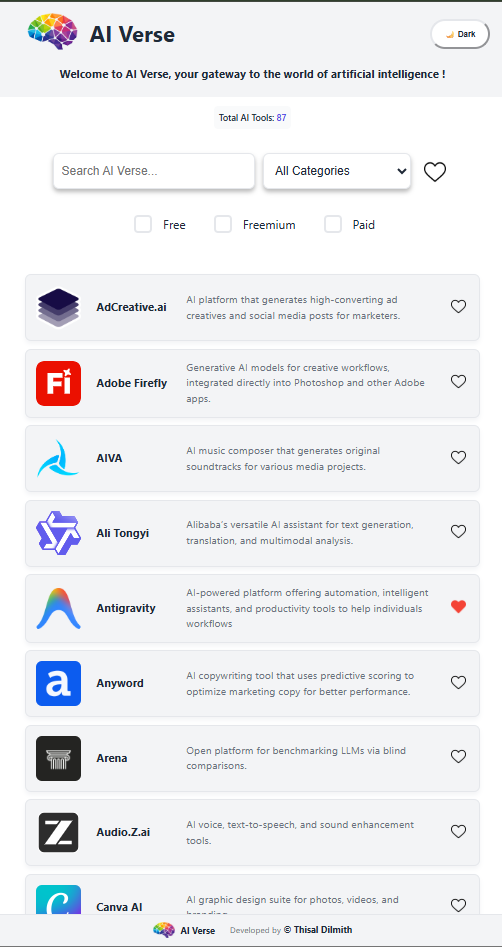

<div align="center">
  <a href="https://a-i-verse.netlify.app/" target="_blank"></a>
  <h1>🌌 AI Verse</h1>
  <p><strong>Your Gateway to the AI Universe</strong></p>
  <p>
    <a href="https://a-i-verse.netlify.app/" target="_blank">🚀 Live Demo</a> •
    <a href="#features">✨ Features</a> •
    <a href="#installation">📦 Installation</a> •
    <a href="#contributing">🤝 Contributing</a>
  </p>
</div>

---

## 📖 What is AI Verse?

**AI Verse** is a curated directory and discovery platform that helps you navigate the rapidly evolving world of Artificial Intelligence tools. Whether you're a developer looking for code assistants, a creator seeking design tools, a student exploring AI learning resources, or an entrepreneur searching for productivity solutions, AI Verse simplifies your search.

With over **45+ hand-picked AI tools** organized into intuitive categories, powerful search capabilities, and detailed pricing information, AI Verse is your one-stop destination to discover, compare, and explore the best AI tools available today.

---

## ✨ Key Features

- 🔍 **Smart Search & Filter** - Find the perfect AI tool using keywords, categories, or pricing tiers
- 🎨 **10+ Categories** - Organized by use case:
  - Text & Writing | Coding & Dev | Image Generation
  - Video & Animation | Audio & Voice | Research & Analysis
  - Productivity | Design | Marketing | Gaming | 3D & AR/VR | Education
- 💰 **Pricing Transparency** - Clearly marked pricing models (Free, Freemium, Paid)
- 🌓 **Dark/Light Theme Support** - Beautiful UI that works in any light condition
- 📱 **Fully Responsive** - Seamless experience on desktop, tablet, and mobile
- 🔄 **Easy to Extend** - Add new tools in seconds with simple JSON configuration

---

## 🎯 Use Cases

| User Type | How AI Verse Helps |
|-----------|------------------|
| **Developers** | Discover coding assistants, IDE integrations, and AI APIs |
| **Designers** | Find image generators, design automation, and 3D creation tools |
| **Content Creators** | Explore video generators, voice synthesis, and music creation tools |
| **Students & Learners** | Access educational AI platforms and research tools |
| **Businesses** | Find productivity solutions and marketing automation tools |

---

## 🖼️ Screenshots

### Desktop View
<picture> 
  <source media="(prefers-color-scheme: dark)" srcset="./README/preview-desktop-dark.png"> 
   
</picture>

### Mobile View
<picture> 
  <source media="(prefers-color-scheme: dark)" srcset="./README/preview-mobile-dark.png" width="300px"> 
   
</picture>

---

## 🚀 Getting Started

### Prerequisites

- **Node.js** v16.0 or higher
- **npm** or **yarn** package manager

### Quick Start

```bash
# 1. Clone the repository
git clone https://github.com/thisal-d/ai-verse.git
cd ai-verse

# 2. Install dependencies
npm install

# 3. Start development server
npm run dev
```

### Build for Production

```bash
npm run build
```

## 🏗️ Project Architecture

```
ai-verse/
├── src/
│   ├── components/        # React components
│   ├── data/
│   │   └── tools.json     # AI tools database (45+ tools)
│   ├── App.jsx            # Main application component
│   └── main.jsx           # Entry point
├── public/
│   └── ai-tools/logo/     # Tool logos (PNG, SVG, WEBP)
├── package.json           # Dependencies & scripts
├── vite.config.js         # Vite configuration
└── index.html             # HTML template
```

### Tech Stack

- **Frontend Framework:** React 18+
- **Build Tool:** Vite (ultra-fast bundler)
- **Styling:** CSS3 with theme support
- **Data Format:** JSON (no database required)
- **Deployment:** Netlify (connected to main branch)

---

## 📝 How to Contribute

AI Verse is community-driven! Adding a new AI tool is straightforward and requires only editing a JSON file.

### Adding a New Tool

#### Step 1: Update `src/data/tools.json`

Add a new object to the `tools` array with the following structure:

```json
{
  "id": 46,
  "name": "Your AI Tool",
  "description": "Brief description of what the tool does and its main features.",
  "url": "https://your-tool-website.com/",
  "categories": ["Category1", "Category2"],
  "keywords": ["keyword1", "keyword2", "keyword3"],
  "pricing": ["Free", "Freemium"],
  "logo": {
    "dark": "ai-tools/logo/png/your-tool-dark.png",
    "light": "ai-tools/logo/png/your-tool-light.png"
  }
}
```

#### Step 2: Add Logo Files

Place your tool's logo in `public/ai-tools/logo/`:
- **Format:** PNG, SVG, or WEBP
- **Size:** 256x256px or larger (square aspect ratio recommended)
- **Naming:** `your-tool.png` or `your-tool.svg`

#### Step 3: Theme Support (Optional)

If your logo needs different colors for light/dark modes:
- Dark: `your-tool-dark.png`
- Light: `your-tool-light.png`

Or use a single logo for both by using the same path for both `dark` and `light` keys.

### Available Categories

- Text & Writing
- Coding & Dev
- Image Generation
- Video & Animation
- Audio & Voice
- Research & Analysis
- Productivity
- Design
- Marketing
- Gaming
- 3D & AR/VR
- Education
- Testing
- Music

### Pricing Tiers

- `Free` - No cost
- `Freemium` - Free with paid options
- `Paid` - Subscription required

---

## 📊 Statistics

- **45+** AI Tools
- **13+** Categories
- **3** Pricing Models
- **100%** Responsive Design

---

## 🌐 Current Tools Featured

The platform includes renowned AI tools like:

**LLMs & Chat:** ChatGPT, Claude, Gemini, DeepSeek, Grok, Nova AI
**Image Generation:** Midjourney, Stable Diffusion, Leonardo.ai, DALL-E
**Video & Animation:** Runway, Pika, Kling AI, HeyGen, Luna AI
**Coding:** GitHub Copilot, Cursor, Replit AI, Qodo
**Audio & Voice:** ElevenLabs, Suno, Audio.Z.ai
**Productivity:** Notion AI, Grammarly, Gamma, Microsoft Copilot

...and many more! 🚀


---

## 📄 License

This project is open source and available under the [MIT License](LICENSE).

---

## 👥 Contributors

We're grateful to the amazing people who help make AI Verse better:

| Contributor | Profile |
|------------|---------|
|  | [Thisurika Hasajith](https://github.com/thisurika) |
|  | [Senuda Dilvan](https://github.com/senuda-d) |
|  | [Fathima Asma](https://github.com/fathi-asma) |
|  | [Childe Youyu](https://github.com/childeyouyu) |

**Want to be featured here?** [Contribute now! 🎉](CONTRIBUTING.md)

---

## 🤔 FAQ

**Q: How often are new tools added?**  
A: Tools are added regularly by our community. Check the [releases page](https://github.com/thisal-d/ai-verse/releases) for updates.

**Q: Can I suggest a tool?**  
A: Absolutely! Open an issue or submit a PR with your suggestion.


**Q: How can I deploy my own instance?**  
A: It's easy! Fork the repo and deploy to Netlify, Vercel, or any static hosting provider.

---

## 📧 Contact & Support

- **Issues:** [GitHub Issues](https://github.com/thisal-d/ai-verse/issues)
- **Discussions:** [GitHub Discussions](https://github.com/thisal-d/ai-verse/discussions)
- **Website:** [a-i-verse.netlify.app](https://a-i-verse.netlify.app/)

---

<div align="center">
  <p>Made with ❤️ for the AI Community</p>
  <p>
    <a href="https://github.com/thisal-d/ai-verse">⭐ Star us on GitHub</a> •
    <a href="https://github.com/thisal-d/ai-verse/fork">🍴 Fork & Contribute</a>
  </p>
</div>