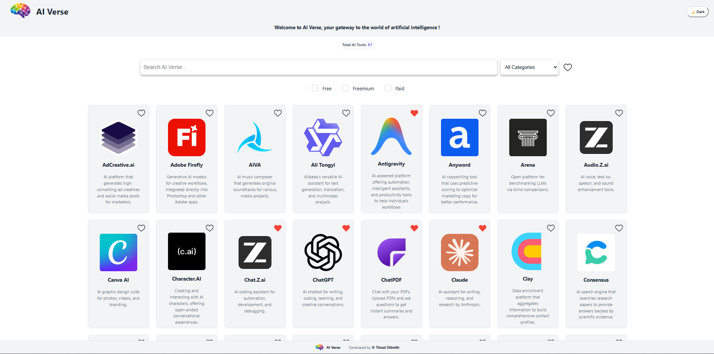
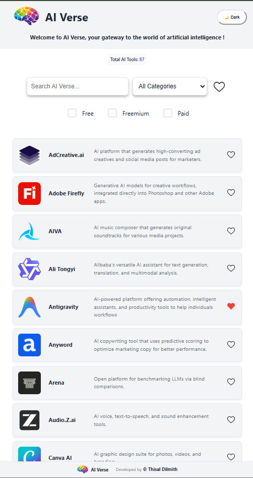

<div align="center">
  <a href="https://a-i-verse.netlify.app/" target="_blank"></a>
  <h1>AI Verse</h1>
  <p><strong>Your Gateway to the AI Universe</strong></p>
  <p>
    <a href="https://a-i-verse.netlify.app/" target="_blank">🚀 Live Demo</a> •
    <a href="#features">✨ Features</a> •
    <a href="#getting-started">📦 Getting Started</a> •
    <a href="#contributing">🤝 Contributing</a>
  </p>
</div>

---

## 📖 About

**AI Verse** is a curated discovery platform for navigating the world of AI tools. Whether you're a developer, designer, student, or entrepreneur — AI Verse helps you find the right AI tool for the job.

With **120+ hand-picked tools** across **14+ categories**, smart search, favorites, and pricing filters — it's your one-stop destination to explore the best AI has to offer.

---

<div id="features">

## ✨ Features

- 🔍 **Smart Search & Filter** — Find tools by keyword, category, or pricing
- ❤️ **Favorites** — Save tools to a personal list (stored in local storage, no login needed)
- 🔔 **Toast Notifications** — Instant feedback when managing your tools
- 🎨 **14+ Categories** — Text & Writing, Coding & Dev, Image Generation, Video & Animation, Audio & Voice, Research & Analysis, Productivity, Design, Marketing, 3D & AR/VR, Education & Learning, Automation & Workflows, AI Detection & Humanization, Translation & Language
- 💰 **Pricing Transparency** — Free, Freemium, Paid, and Open Source tiers clearly marked
- 🌓 **Dark / Light Theme** — Beautiful in any lighting
- 📱 **Fully Responsive** — Desktop, tablet, and mobile
- 🔄 **Easy to Extend** — Add new tools via simple JSON configuration

</div>

---

## 🖼️ Screenshots

### Desktop
<picture>
  <source media="(prefers-color-scheme: dark)" srcset="./README/preview-desktop-dark.png">
  
</picture>

### Mobile
<picture>
  <source media="(prefers-color-scheme: dark)" srcset="./README/preview-mobile-dark.png" width="300px">
  
</picture>

---

<div id="getting-started">

## 🚀 Getting Started

### Prerequisites

- **Node.js** v16.0+
- **npm** or **yarn**

### Quick Start

```bash
# Clone the repository
git clone https://github.com/thisal-d/ai-verse.git
cd ai-verse

# Install dependencies
npm install

# Start development server
npm run dev
```

### Production Build

```bash
npm run build
```

</div>

---

## 🏗️ Project Structure

```
ai-verse/
├── src/
│   ├── components/          # React components
│   ├── data/
│   │   ├── tools.json       # AI tools database (90+ tools)
│   │   └── categories.json  # Category definitions
│   ├── App.jsx              # Main app component
│   └── main.jsx             # Entry point
├── public/
│   └── ai-tools/logo/       # Tool logos (PNG, SVG, WEBP, ICO, JPG)
├── package.json
├── vite.config.js
└── index.html
```

### Tech Stack

| Layer | Technology |
|-------|-----------|
| Framework | React 19+ |
| Build Tool | Vite 7+ |
| Styling | CSS3 with theme support |
| Notifications | React Toastify |
| Data | JSON & LocalStorage |
| Deployment | Netlify |

---

<div id="contributing">

## 🤝 Contributing

AI Verse is community-driven! We use dedicated feature branches to keep contributions organized:

| Action | Branch |
|--------|--------|
| ➕ Add a new tool | `feature/add-tools` |
| ✏️ Modify a tool | `feature/modify-tools` |
| 🗑️ Remove a tool | `feature/remove-tools` |

👉 **Read the full guide:** [CONTRIBUTING.md](CONTRIBUTING.md)

</div>

---

## 👥 Contributors

We're grateful to the amazing people who help make AI Verse better:

| Contributor | Profile |
|------------|---------|
|  | [Thisurika Hasajith](https://github.com/thisurika) |
|  | [Senuda Dilvan](https://github.com/senuda-d) |
|  | [Fathima Asma](https://github.com/fathi-asma) |
|  | [Childe Youyu](https://github.com/childeyouyu) |
|  | [Tharusha Akash](https://github.com/TharushaAkash) |

**Want to be listed here?** [Start contributing! 🎉](#contributing)

---

## 📄 License

This project is open source under the [MIT License](LICENSE).

---

<div align="center">
  <p>Made with ❤️ for the AI Community</p>
  <p>
    <a href="https://github.com/thisal-d/ai-verse">⭐ Star us on GitHub</a> •
    <a href="https://github.com/thisal-d/ai-verse/fork">🍴 Fork & Contribute</a>
  </p>
</div>